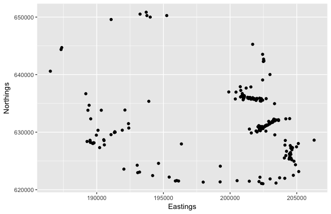
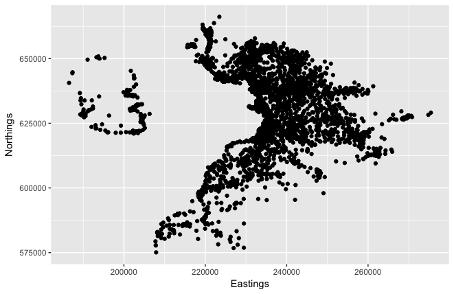
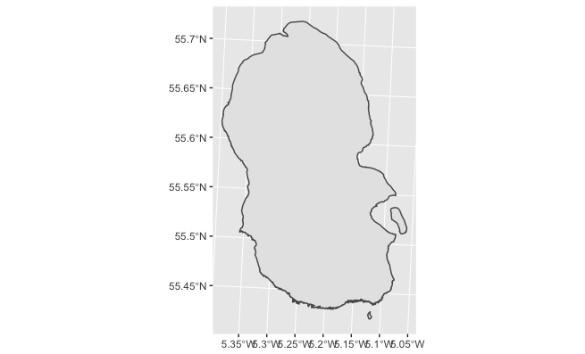
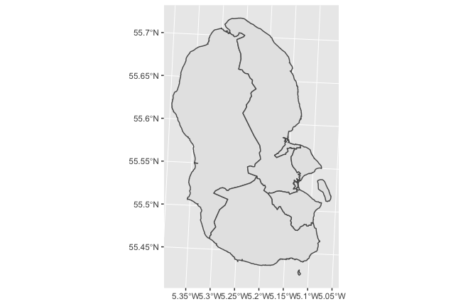
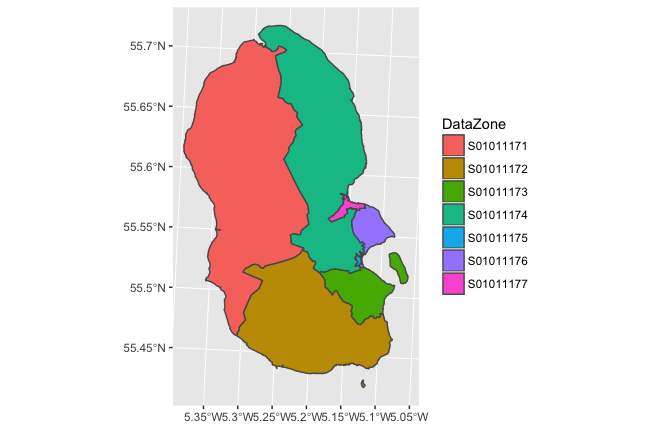
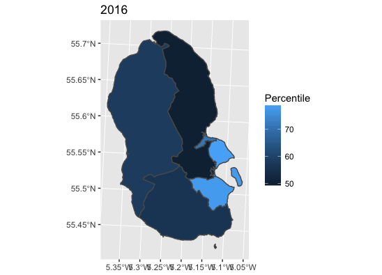
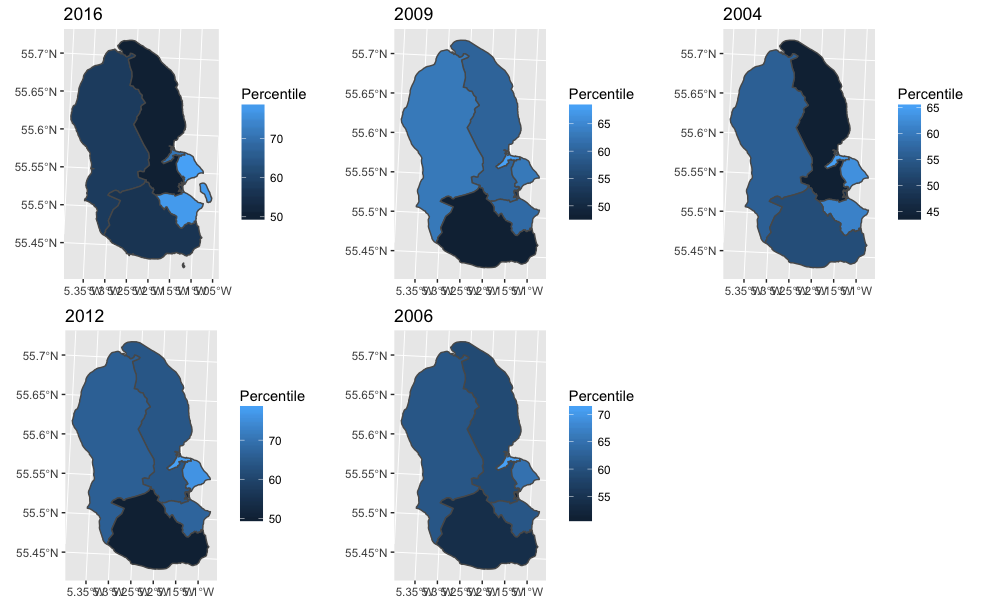

## Introduction
This is an early project based on SIMD data that I'm using to try and learn R.
I intend to explore the package ['ggplot2'](http://ggplot2.tidyverse.org/reference/ggsf.html) to practice a set of skills I'm attempting to learn through a combination of [DataCamp courses](https://www.datacamp.com/courses/free-introduction-to-r), [RStudio 'Cheat Sheets'](https://www.rstudio.com/resources/cheatsheets/) and [twitter](https://twitter.com/hashtag/Rstats?src=hash).

### Early progress

Initially I used map cordinates given by [Ordinance Survey](https://www.ordnancesurvey.co.uk/opendatadownload/products.html) to find the centre of any KA27 postcode on a map.
(KA27 being the prefix or 'postcode area' that denotes all Aran Island postcodes).
I then used the ggplot function 'geom_point' to plot these postcodes as points on a map.

N.B Actually I first plotted the coordinates of the entire map section, (NR), before taking a shockingly large amount of time to work out how to filter the postcodes down futher, see below.

With the postcodes sorted, I then wanted to get relate some other information to these areas.
I used [SIMD](www.gov.scot/Topics/Statistics/SIMD) 'DataZone boundraries' and plotted their ERSI Shapefiles using 'geom_sf.' 
First the whole island together.

Then the data zones onto the island.

I then skipped a few steps and coloured/labelled the individual data zones.

Having worked that out, I wanted to show some health data about the zones. I overlayed 'percentile' data about the areas for 2016.

Then after faffing about with individual shape files for every year, (The data zone labels changed after 2012), I did the same for all the SIMD data periods and used multiplot to add them together.

The next steps for me are to join the yearly data frames together and use facet_wrap to create a graph for each year.

Then to overlay the coordinates onto the maps.

[See the code.](Arran_Workbook.html)
[See the code.](../Arran_Workbook.nb.html)
[See the code.](Arran_Workbook.nb.html)
[See the code.](../Arran_Workbook.html)

[Other projects I'm working on.](https://fergustaylor.github.io) 
