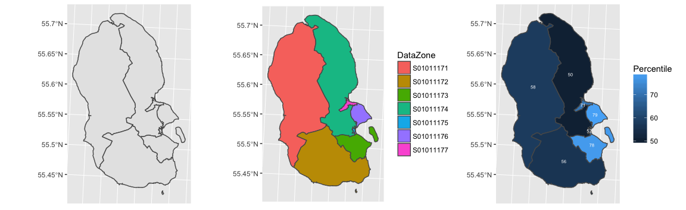
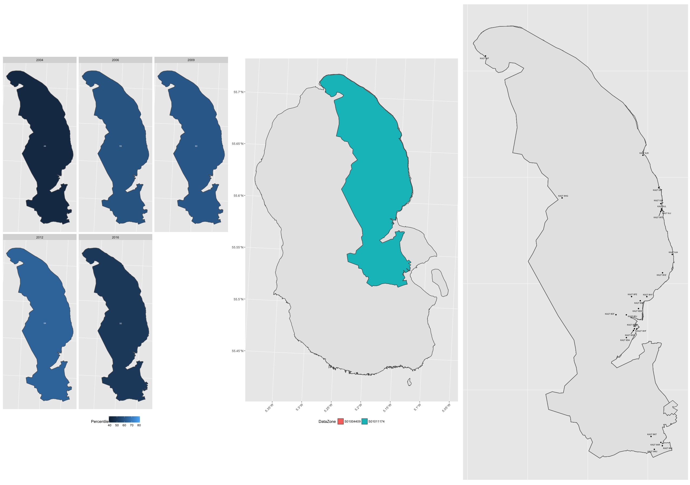
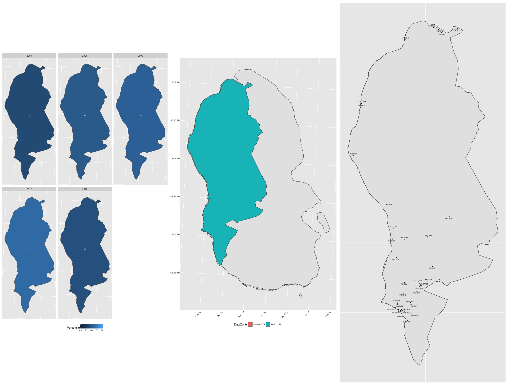
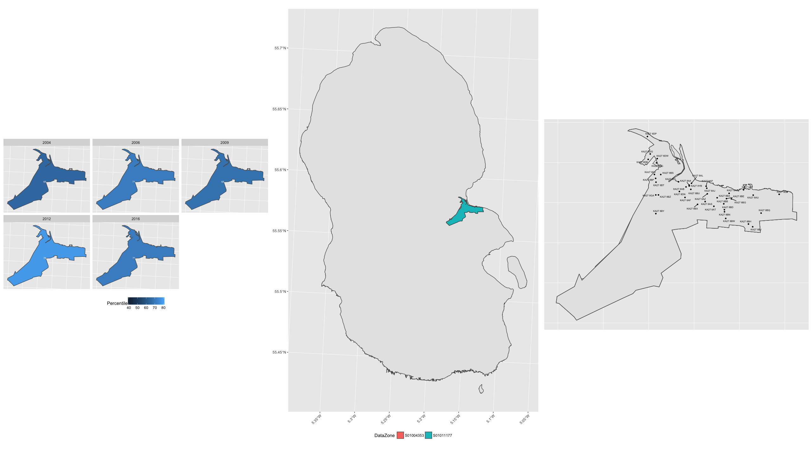
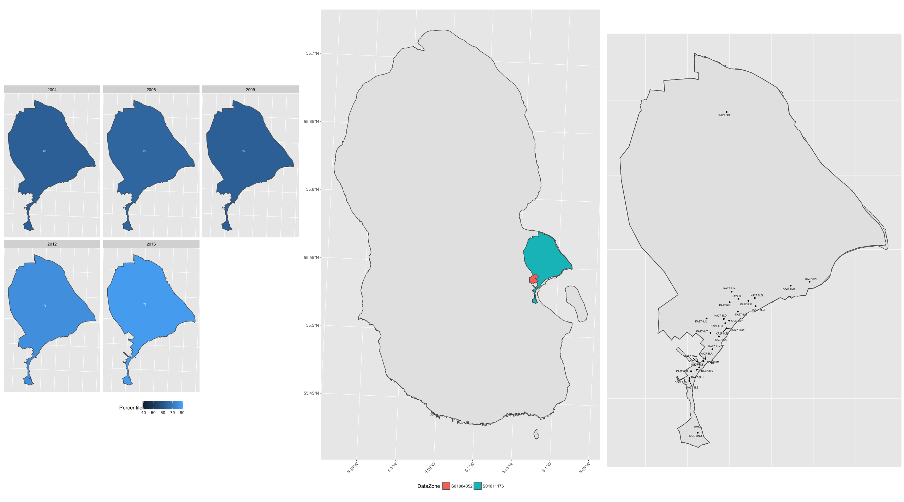
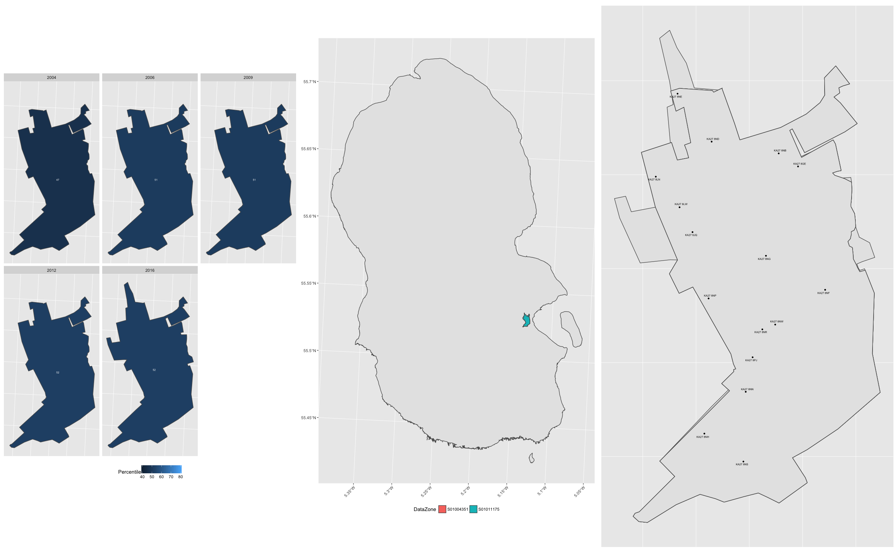
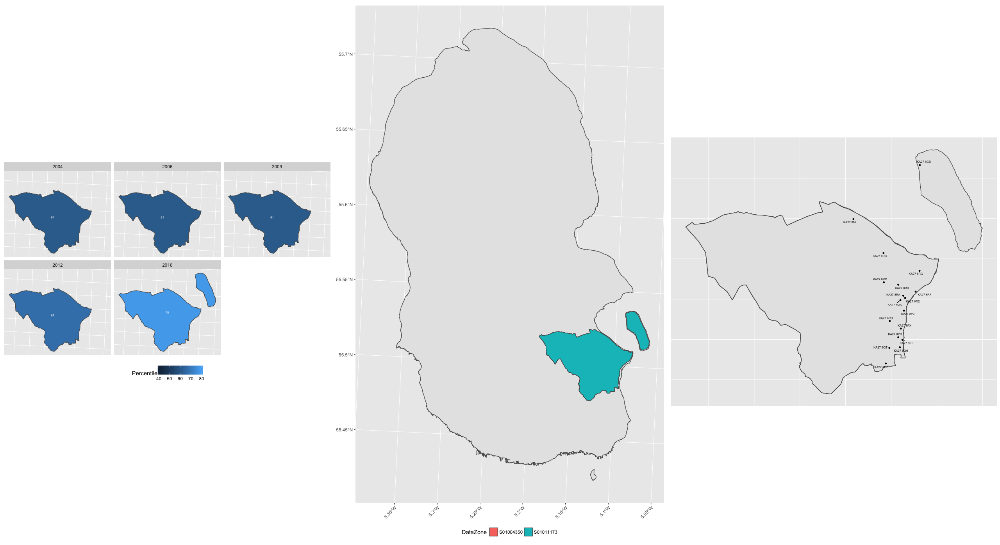
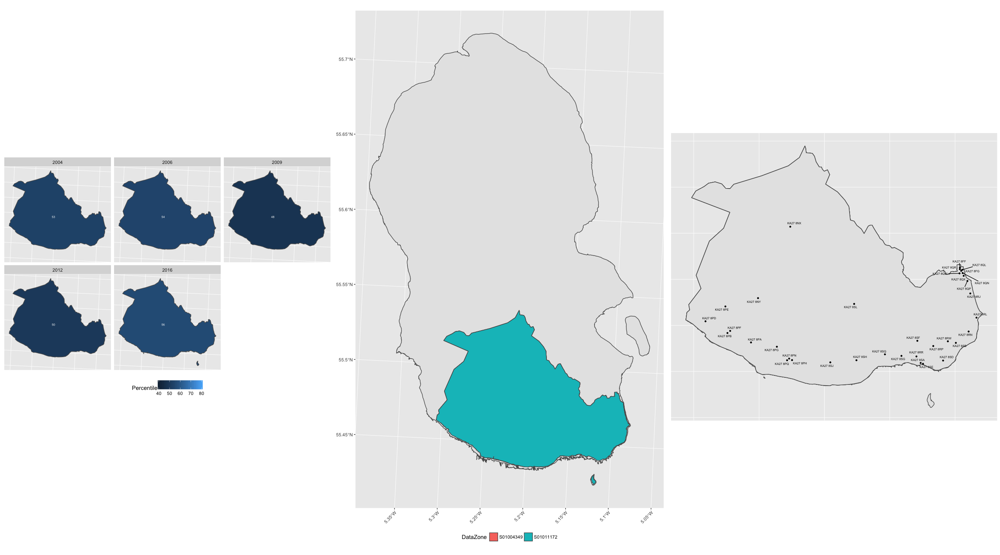

## Introduction
This is an early project based on SIMD data that I'm using to try and learn R.
I intend to explore the package ['ggplot2'](http://ggplot2.tidyverse.org/reference/ggsf.html) to practice a set of skills I'm attempting to learn through a combination of [DataCamp courses](https://www.datacamp.com/courses/free-introduction-to-r), [RStudio 'Cheat Sheets'](https://www.rstudio.com/resources/cheatsheets/) and [twitter](https://twitter.com/hashtag/Rstats?src=hash).

<iframe src="map.html">
</iframe>

[See the map.](map.html)

### Early progress

Initially I used map cordinates given by [Ordinance Survey](https://www.ordnancesurvey.co.uk/opendatadownload/products.html) to find the centre of any KA27 postcode on a map.
(KA27 being the prefix or 'postcode area' that denotes all Aran Island postcodes).

I then read the coordinates into sf with st_as_sf(), and plotted over a shape file map of Arran; over the SIMD data zones, as well as the section of coordinates contained in one data zone/

With the postcodes sorted, I then wanted to relate some other information about these areas.
I used [SIMD](www.gov.scot/Topics/Statistics/SIMD) 'DataZone boundraries' and plotted their ERSI Shapefiles using 'geom_sf.' 
First the data zones onto the island.
Then I coloured/labelled the individual data zones.
Having worked that out, I wanted to show some health data about the zones. I overlayed 'percentile' data about the areas for 2016.

Then after faffing about with individual shape files for every year, (The data zone labels changed after 2012), I did the same for all the SIMD data periods and used facet_wrap to plot them all together.

Combining the coordinate and SIMD data, I've summarised one of the zones (S01004372) below.

##{.tabset}
### S01004409/S01011174

### S01004372/S01011171

### S01004353/S01011177

### S01004352/S01011176

### S01004351/S01011175

### S01004350/S01011173

### S01004349/S01011172

The next steps will be to overlay this data over a map using leaflet.

[See this on a map.](map.html)

The overall aim of this project will be to create an easy template by which a user with no prior programming knowledge can create interactive graphs by overlaying some form of data attributed to a postcode alone.

[See the full code.](Arran_Workbook.html)

[See the code specific to these graphics.](front_page_graphics.html)

[Back.](https://fergustaylor.github.io/Arran) 

[Other projects I'm working on.](https://fergustaylor.github.io) 
